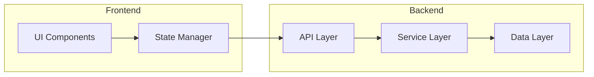
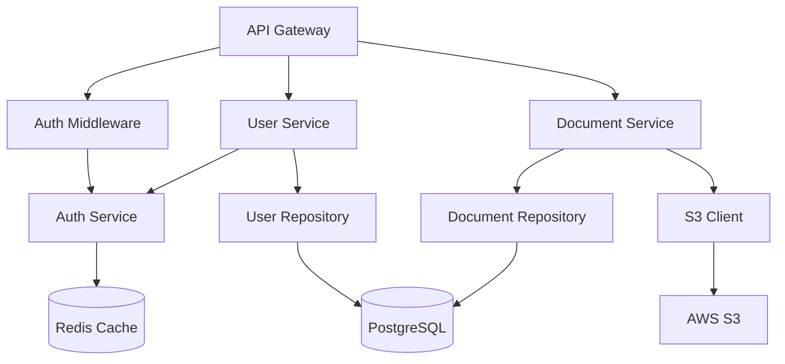

# Component Breakdown

<!-- TEMPLATE GUIDE (이 주석은 실제 프로젝트에서 삭제하세요 / Delete this comment in actual projects)

이 파일은 시스템의 각 구성 요소를 상세히 문서화합니다.
This file provides detailed documentation for each system component.

작성 시 포함해야 할 내용 / What to include:
- List of all major components
- Purpose and responsibilities of each component
- Public interfaces (APIs, methods, events)
- Dependencies and relationships
- Usage examples and patterns
- Configuration options

각 컴포넌트별 작성 팁 / Tips for each component:
- 컴포넌트가 "무엇을 하는지"를 명확히 설명하세요 (Purpose)
- 다른 컴포넌트와의 관계를 명시하세요 (Dependencies)
- 실제 사용 예제를 포함하세요 (Usage Examples)
- 설정 가능한 옵션을 문서화하세요 (Configuration)

-->

> Detailed documentation of system components for {{project-name}}.
>
> **Navigation**: [docs/](../index.md) > architecture > components

---

## Component Overview

<!-- 시스템의 모든 주요 컴포넌트를 한눈에 보여주세요
     Provide a high-level view of all major components -->

### Component Map



### Component List

| Component | Purpose | Type | Language/Framework |
|-----------|---------|------|-------------------|
| _[e.g., UserService]_ | _[e.g., Manage user accounts]_ | _[e.g., Service]_ | _[e.g., TypeScript/Node.js]_ |
| _[e.g., AuthMiddleware]_ | _[e.g., Handle authentication]_ | _[e.g., Middleware]_ | _[e.g., TypeScript/Express]_ |
| _[e.g., Database]_ | _[e.g., Data persistence]_ | _[e.g., Storage]_ | _[e.g., PostgreSQL]_ |

**Example Component List**:

| Component | Purpose | Type | Language/Framework |
|-----------|---------|------|-------------------|
| API Gateway | Route and validate HTTP requests | Infrastructure | TypeScript/Express |
| User Service | User registration, authentication, profile management | Business Logic | TypeScript |
| Document Parser | Extract and structure content from documents | Business Logic | TypeScript |
| PostgreSQL | Relational data storage | Data Store | PostgreSQL 16 |
| Redis Cache | High-speed caching layer | Data Store | Redis 7.x |
| S3 Client | File storage operations | Infrastructure | TypeScript/AWS SDK |

---

## Component 1: _[Name]_

<!-- 각 주요 컴포넌트에 대해 이 섹션을 복제하세요
     Duplicate this section for each major component -->

### Purpose

_[What this component does and why it exists]_

**Example**:
Handles user authentication and authorization. Validates credentials, manages sessions, and enforces access control policies.

### Responsibilities

- _[Responsibility 1]_
- _[Responsibility 2]_
- _[Responsibility 3]_

**Example**:
- Authenticate users via email/password or OAuth providers
- Generate and validate JWT tokens
- Enforce role-based access control (RBAC)
- Manage user sessions and token refresh

### Interface

<!-- 컴포넌트의 공개 API를 정의하세요
     Define the component's public API -->

```typescript
// Example interface
interface ComponentName {
  // Public methods
  method1(param: Type): ReturnType;
  method2(param: Type): Promise<ReturnType>;

  // Properties
  property1: Type;
}
```

**Example (Authentication Service)**:

```typescript
interface AuthService {
  // Authentication methods
  login(email: string, password: string): Promise<AuthResult>;
  logout(userId: string): Promise<void>;
  refreshToken(refreshToken: string): Promise<TokenPair>;

  // Authorization methods
  validateToken(token: string): Promise<User>;
  hasPermission(userId: string, permission: string): Promise<boolean>;

  // OAuth methods
  loginWithGoogle(code: string): Promise<AuthResult>;
  loginWithGithub(code: string): Promise<AuthResult>;
}

interface AuthResult {
  user: User;
  accessToken: string;
  refreshToken: string;
  expiresIn: number;
}

interface TokenPair {
  accessToken: string;
  refreshToken: string;
}
```

### Dependencies

<!-- 이 컴포넌트가 의존하는 다른 컴포넌트나 서비스를 나열하세요
     List other components or services this component depends on -->

**Internal Dependencies**:
- _[Internal Component 1]_ - _[Why needed]_
- _[Internal Component 2]_ - _[Why needed]_

**External Dependencies**:
- _[External Service 1]_ - _[Why needed]_
- _[NPM Package]_ - _[Why needed]_

**Example**:

**Internal Dependencies**:
- `UserRepository` - Fetch user data from database
- `EmailService` - Send password reset emails
- `CacheService` - Cache session data for performance

**External Dependencies**:
- `jsonwebtoken` - JWT token generation and validation
- `bcrypt` - Password hashing and comparison
- `passport` - OAuth authentication strategies

### Configuration

<!-- 설정 가능한 옵션을 문서화하세요
     Document configurable options -->

```typescript
// Configuration interface
interface ComponentConfig {
  option1: string;
  option2: number;
  option3?: boolean; // Optional
}
```

**Example**:

```typescript
interface AuthConfig {
  // JWT settings
  jwtSecret: string;
  jwtExpiresIn: string; // e.g., "15m"
  refreshTokenExpiresIn: string; // e.g., "7d"

  // OAuth providers
  googleClientId?: string;
  googleClientSecret?: string;
  githubClientId?: string;
  githubClientSecret?: string;

  // Security settings
  maxLoginAttempts: number; // default: 5
  lockoutDuration: number; // in minutes, default: 15
  passwordMinLength: number; // default: 8
}
```

### Usage

<!-- 실제 사용 예제를 제공하세요
     Provide practical usage examples -->

```typescript
// Example: Basic usage
const component = new ComponentName({
  option1: 'value1',
  option2: 42
});

const result = await component.method1(input);
```

**Example (Authentication Service)**:

```typescript
// Example 1: User login
const authService = new AuthService({
  jwtSecret: process.env.JWT_SECRET,
  jwtExpiresIn: '15m',
  refreshTokenExpiresIn: '7d'
});

try {
  const result = await authService.login('user@example.com', 'password123');
  console.log('Access token:', result.accessToken);
  console.log('User:', result.user);
} catch (error) {
  console.error('Login failed:', error);
}

// Example 2: Token validation in middleware
app.use(async (req, res, next) => {
  const token = req.headers.authorization?.split(' ')[1];

  try {
    const user = await authService.validateToken(token);
    req.user = user;
    next();
  } catch (error) {
    res.status(401).json({ error: 'Invalid token' });
  }
});

// Example 3: OAuth login
app.get('/auth/google/callback', async (req, res) => {
  const { code } = req.query;

  try {
    const result = await authService.loginWithGoogle(code);
    res.json(result);
  } catch (error) {
    res.status(400).json({ error: 'OAuth login failed' });
  }
});
```

### Error Handling

<!-- 이 컴포넌트가 발생시킬 수 있는 에러들을 문서화하세요
     Document errors this component may throw -->

**Possible Errors**:

| Error Type | When Thrown | How to Handle |
|------------|-------------|---------------|
| _[ErrorName]_ | _[Condition]_ | _[Recommended handling]_ |

**Example**:

| Error Type | When Thrown | How to Handle |
|------------|-------------|---------------|
| `InvalidCredentialsError` | Email or password is incorrect | Show user-friendly message, don't reveal which field is wrong |
| `AccountLockedError` | Too many failed login attempts | Ask user to wait or reset password |
| `TokenExpiredError` | JWT token has expired | Refresh token or redirect to login |
| `InvalidTokenError` | JWT signature invalid | Clear stored token, redirect to login |
| `OAuthProviderError` | OAuth provider returns error | Show error message, allow retry |

### Testing

<!-- 테스트 전략을 간단히 설명하세요
     Briefly describe testing strategy -->

**Test Coverage**:
- Unit tests: _[What's covered]_
- Integration tests: _[What's covered]_
- Mock dependencies: _[What's mocked]_

**Example**:

```typescript
describe('AuthService', () => {
  it('should authenticate user with valid credentials', async () => {
    const authService = new AuthService(testConfig);
    const result = await authService.login('user@example.com', 'password123');

    expect(result.user.email).toBe('user@example.com');
    expect(result.accessToken).toBeDefined();
  });

  it('should throw InvalidCredentialsError for wrong password', async () => {
    const authService = new AuthService(testConfig);

    await expect(
      authService.login('user@example.com', 'wrongpassword')
    ).rejects.toThrow(InvalidCredentialsError);
  });
});
```

---

## Component 2: _[Name]_

<!-- 다른 컴포넌트에 대해 위와 같은 구조로 문서화하세요
     Document other components following the same structure -->

### Purpose

_[What this component does and why it exists]_

### Responsibilities

- _[Responsibility 1]_
- _[Responsibility 2]_

### Interface

```typescript
// Component interface
```

### Dependencies

**Internal Dependencies**:
- _[Component 1]_

**External Dependencies**:
- _[Package 1]_

### Usage

```typescript
// Example usage
```

---

## Component Relationships

<!-- 컴포넌트 간의 관계를 시각화하세요
     Visualize relationships between components -->

### Dependency Graph



### Communication Patterns

| Pattern | Components | Description |
|---------|------------|-------------|
| _[e.g., Request-Response]_ | _[Component A → Component B]_ | _[Description]_ |
| _[e.g., Event-Driven]_ | _[Component C → Component D]_ | _[Description]_ |

**Example**:

| Pattern | Components | Description |
|---------|------------|-------------|
| Request-Response | API Gateway → Services | Synchronous HTTP requests |
| Event-Driven | Document Service → Email Service | Async notifications via message queue |
| Repository Pattern | Services → Repositories | Data access abstraction |
| Decorator Pattern | Auth Middleware → Route Handlers | Authentication wrapping |

---

## Component Lifecycle

<!-- 컴포넌트의 생명주기를 설명하세요
     Describe component lifecycle -->

### Initialization Order

1. _[Component 1]_ - _[Why first]_
2. _[Component 2]_ - _[Why second]_
3. _[Component 3]_ - _[Why third]_

**Example**:

1. **Database Connection** - Must be available before repositories
2. **Cache Connection** - Needed for session storage
3. **Repositories** - Depend on database and cache
4. **Services** - Depend on repositories
5. **Middleware** - Depend on services
6. **API Routes** - Depend on middleware and services

### Shutdown Sequence

1. _[Step 1]_ - _[Gracefully close connections]_
2. _[Step 2]_ - _[Cleanup resources]_

**Example**:

1. **Stop accepting new requests** - Close HTTP server
2. **Complete in-flight requests** - Wait for ongoing operations (max 30s)
3. **Close service connections** - Disconnect from external services
4. **Close database connections** - Graceful database shutdown
5. **Exit process** - Exit with appropriate code

---

## Best Practices

<!-- 컴포넌트 사용 시 권장사항을 제공하세요
     Provide recommendations for using components -->

### Do's

- ✅ _[Good practice 1]_
- ✅ _[Good practice 2]_

### Don'ts

- ❌ _[Anti-pattern 1]_
- ❌ _[Anti-pattern 2]_

**Example**:

### Do's

- ✅ Use dependency injection for loose coupling
- ✅ Handle errors at appropriate boundaries
- ✅ Log important events with context
- ✅ Write tests for public interfaces
- ✅ Use TypeScript interfaces for contracts

### Don'ts

- ❌ Don't directly access database from controllers
- ❌ Don't catch errors without logging them
- ❌ Don't expose internal implementation details
- ❌ Don't mix business logic with HTTP concerns
- ❌ Don't use any types in public interfaces

---

## Performance Considerations

<!-- 성능 관련 주의사항을 문서화하세요
     Document performance-related considerations -->

### Optimization Strategies

- **Caching**: _[What is cached and for how long]_
- **Database**: _[Index strategies, query optimization]_
- **Async Operations**: _[What runs asynchronously]_

**Example**:

- **Caching**: User sessions cached in Redis for 15 minutes
- **Database**: Indexes on userId, email, createdAt for fast lookups
- **Async Operations**: Email sending, document parsing run in background jobs
- **Connection Pooling**: Database pool size: 10-20 connections
- **Rate Limiting**: 100 requests/minute per user to prevent abuse

---

## Related Documents

- [Architecture Overview](./overview.md) - High-level system architecture
- [Data Flow](./data-flow.md) - How data moves through components
- [API Reference](../api/reference.md) - HTTP API documentation
- [Testing Guide](../guides/testing.md) - How to test components
