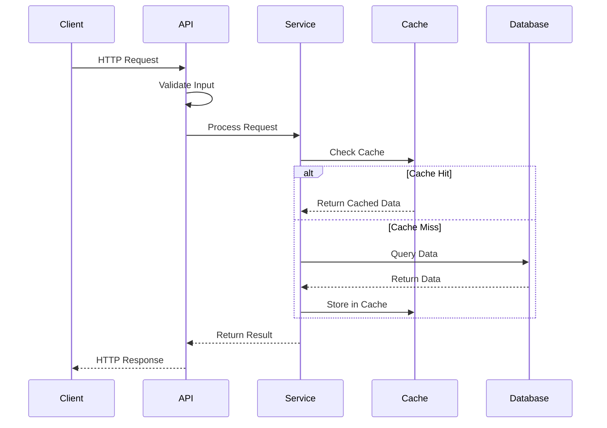
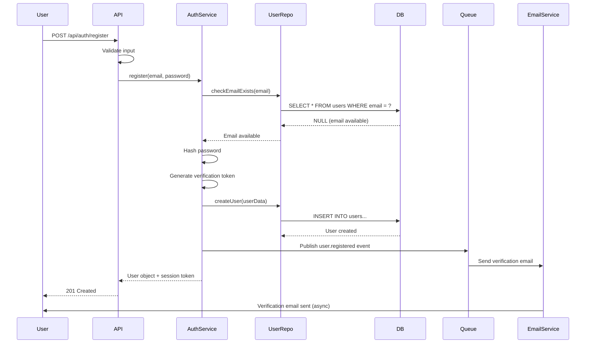
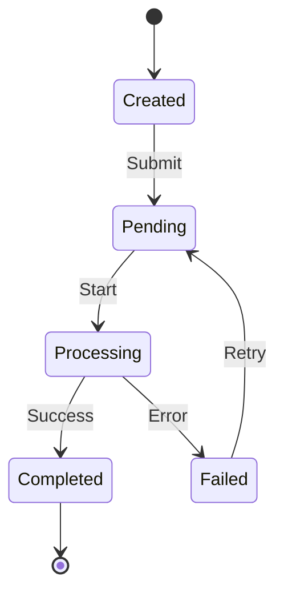
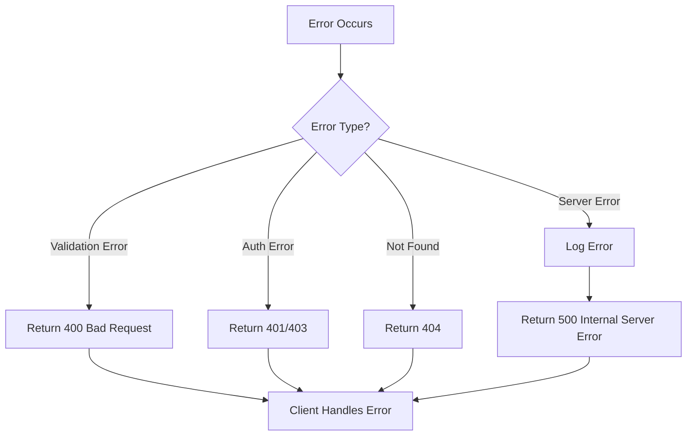
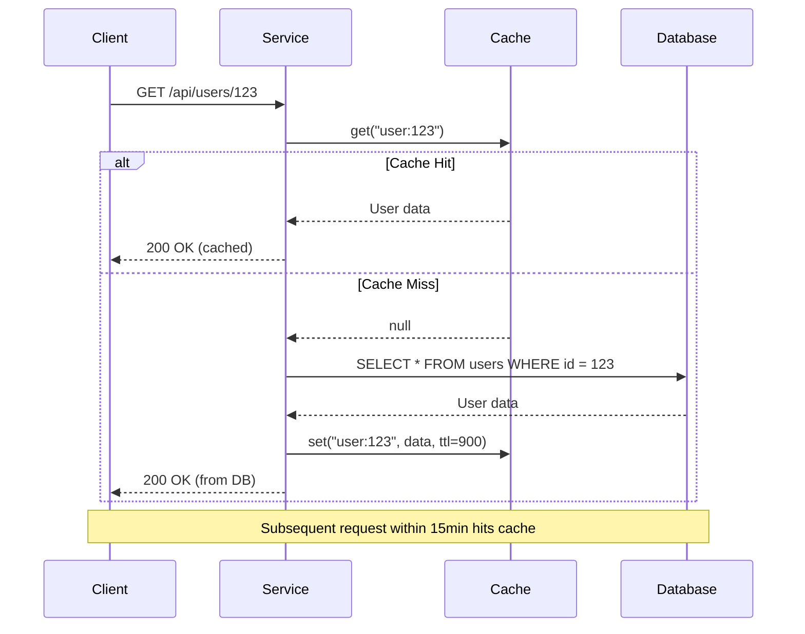

# Data Flow

<!-- TEMPLATE GUIDE (이 주석은 실제 프로젝트에서 삭제하세요 / Delete this comment in actual projects)

이 파일은 시스템을 통한 데이터의 흐름을 문서화합니다.
This file documents how data flows through the system.

작성 시 포함해야 할 내용 / What to include:
- Overall data flow patterns
- Sequence diagrams for key user journeys
- Data transformation at each step
- State transitions
- Error handling flows
- Data validation points

데이터 흐름 문서화의 목적 / Purpose of data flow documentation:
- 데이터가 어떻게 변환되고 이동하는지 이해
- 성능 병목 지점 파악
- 에러 발생 시 디버깅 지점 확인
- 새로운 기능 추가 시 영향 범위 분석

-->

> How data moves through {{project-name}}.
>
> **Navigation**: [docs/](../index.md) > architecture > data-flow

---

## Overview

<!-- 전체 데이터 흐름을 간략히 설명하세요
     Briefly describe the overall data flow -->

_[Describe the overall data flow patterns in your system]_

**Example**:
Data flows through three main layers: the API layer validates and routes requests, the service layer processes business logic, and the data layer persists information. Read operations are cached for performance, while write operations are queued for async processing when appropriate.

### Key Flow Patterns

| Pattern | Use Case | Example |
|---------|----------|---------|
| _[e.g., Request-Response]_ | _[When used]_ | _[Example scenario]_ |
| _[e.g., Event-Driven]_ | _[When used]_ | _[Example scenario]_ |
| _[e.g., Batch Processing]_ | _[When used]_ | _[Example scenario]_ |

**Example**:

| Pattern | Use Case | Example |
|---------|----------|---------|
| Request-Response | User-initiated actions requiring immediate feedback | Login, fetch user profile |
| Event-Driven | Background tasks that don't block user | Send email, generate report |
| Batch Processing | Scheduled operations on large datasets | Daily analytics, cleanup jobs |
| Stream Processing | Real-time data processing | Live notifications, metrics |

---

## High-Level Data Flow

<!-- 시스템의 전체 데이터 흐름을 시각화하세요
     Visualize the overall system data flow -->



### Alternative: ASCII Diagram

<!-- 간단한 시스템의 경우 ASCII 다이어그램 사용
     Use ASCII diagrams for simpler systems -->

```
┌──────────┐
│  Client  │
└────┬─────┘
     │ 1. HTTP Request (JSON)
     │
┌────▼──────────────────────────────────────┐
│          API Gateway / Router             │
│  - Validate request schema                │
│  - Authenticate user                      │
│  - Rate limiting                          │
└────┬──────────────────────────────────────┘
     │ 2. Validated Request
     │
┌────▼──────────────────────────────────────┐
│        Business Logic Layer               │
│  - Apply business rules                   │
│  - Transform data                         │
│  - Orchestrate operations                 │
└────┬──────────────────────────────────────┘
     │ 3. Data Operations
     │
     ├───────────────┬──────────────┐
     │               │              │
┌────▼─────┐  ┌─────▼────┐  ┌──────▼──────┐
│ Database │  │  Cache   │  │ External API│
│ (Write)  │  │  (Read)  │  │  (Notify)   │
└──────────┘  └──────────┘  └─────────────┘
```

---

## Detailed Flow Descriptions

<!-- 주요 사용자 시나리오별로 상세한 흐름을 작성하세요
     Document detailed flows for key user scenarios -->

### Flow 1: _[Name, e.g., "User Registration"]_

<!-- 각 플로우에 대해 이 섹션을 복제하세요
     Duplicate this section for each major flow -->

**Purpose**: _[What this flow accomplishes]_

**Trigger**: _[What initiates this flow]_

**Steps**:

1. _[Step 1: What happens, where, and why]_
2. _[Step 2: Include validation, transformation details]_
3. _[Step 3: Error handling, edge cases]_
4. _[Step 4: Final outcome]_

**Example (User Registration Flow)**:

**Purpose**: Create a new user account with email verification

**Trigger**: User submits registration form via `/api/auth/register`

**Steps**:

1. **API Layer receives request** (`POST /api/auth/register`)
   - Validates email format, password strength
   - Checks rate limiting (max 3 registrations per IP per hour)
   - Sanitizes input to prevent injection attacks

2. **Service Layer processes registration**
   - Checks if email already exists in database
   - Hashes password using bcrypt (10 rounds)
   - Generates email verification token (UUID)
   - Creates user record with `verified: false` status

3. **Database Layer persists data**
   - Inserts user into `users` table
   - Stores verification token with 24-hour expiry
   - Transaction committed if all operations succeed

4. **Event Layer triggers notifications**
   - Publishes `user.registered` event to message queue
   - Email service consumes event and sends verification email
   - Returns success response to user immediately (async email)

5. **Response returned to client**
   - Returns user object (without password hash)
   - Returns temporary session token
   - Client redirects to "check your email" page

**Sequence Diagram**:



### Flow 2: _[Name, e.g., "Document Upload and Processing"]_

**Purpose**: _[What this flow accomplishes]_

**Trigger**: _[What initiates this flow]_

**Steps**:

1. _[Step 1]_
2. _[Step 2]_
3. _[Step 3]_

**Example (Document Upload Flow)**:

**Purpose**: Upload, validate, and extract content from documents

**Trigger**: User uploads document via `/api/documents/upload`

**Steps**:

1. **File Upload** - Multipart form data received
   - Validate file size (max 10MB)
   - Validate file type (PDF, DOCX, TXT)
   - Generate unique file ID

2. **Storage** - File saved to S3
   - Upload to S3 with server-side encryption
   - Store metadata in database (filename, size, type, upload time)

3. **Processing Queue** - Async job created
   - Publish `document.uploaded` event
   - Parser service picks up job from queue

4. **Content Extraction** - Parser processes document
   - Extract text using appropriate parser (PDF.js, Mammoth, etc.)
   - Generate preview thumbnail
   - Extract metadata (author, creation date, etc.)

5. **Indexing** - Processed content stored
   - Save extracted text to database
   - Update search index for full-text search
   - Store thumbnail in S3

6. **Notification** - User notified of completion
   - Publish `document.processed` event
   - WebSocket notification sent to user
   - Status changed to "ready"

---

## Data Transformations

<!-- 데이터가 각 계층에서 어떻게 변환되는지 문서화하세요
     Document how data is transformed at each layer -->

### Transformation Pipeline

| Stage | Input Format | Output Format | Operations |
|-------|-------------|---------------|------------|
| _[Stage 1]_ | _[Format]_ | _[Format]_ | _[What happens]_ |
| _[Stage 2]_ | _[Format]_ | _[Format]_ | _[What happens]_ |

**Example (User Data Transformation)**:

| Stage | Input Format | Output Format | Operations |
|-------|-------------|---------------|------------|
| Client Request | Form Data | JSON | Serialize form fields to JSON object |
| API Validation | Raw JSON | Validated DTO | Parse, type check, sanitize inputs |
| Service Layer | DTO | Domain Model | Apply business rules, set defaults |
| Database Layer | Domain Model | SQL | Map object to table columns |
| Storage | SQL Result | Domain Model | Hydrate object from query result |
| API Response | Domain Model | JSON | Serialize, remove sensitive fields |
| Client | JSON | UI State | Parse and merge into application state |

### Example Transformation

**Input (Client Request)**:
```json
{
  "email": "user@example.com",
  "password": "SecurePass123!",
  "name": "John Doe"
}
```

**After Validation (DTO)**:
```typescript
{
  email: "user@example.com",        // validated email format
  password: "SecurePass123!",       // validated strength
  name: "John Doe",                 // sanitized
  createdAt: "2026-01-20T10:30:00Z" // added by server
}
```

**After Service Processing (Domain Model)**:
```typescript
{
  id: "usr_abc123",
  email: "user@example.com",
  passwordHash: "$2b$10$...",       // hashed password
  name: "John Doe",
  verified: false,                  // default value
  role: "user",                     // default role
  createdAt: Date("2026-01-20T10:30:00Z"),
  updatedAt: Date("2026-01-20T10:30:00Z")
}
```

**API Response (Public DTO)**:
```json
{
  "id": "usr_abc123",
  "email": "user@example.com",
  "name": "John Doe",
  "verified": false,
  "createdAt": "2026-01-20T10:30:00Z"
}
// Note: passwordHash, internal fields removed
```

---

## State Transitions

<!-- 데이터의 상태 변화를 문서화하세요
     Document how data states change -->

### Entity State Diagram



### Example State Transitions

**Document Processing States**:

| State | Description | Valid Transitions |
|-------|-------------|-------------------|
| `UPLOADED` | File uploaded, not yet queued | → `QUEUED` |
| `QUEUED` | Waiting for processing | → `PROCESSING`, `CANCELLED` |
| `PROCESSING` | Currently being processed | → `COMPLETED`, `FAILED` |
| `COMPLETED` | Successfully processed | _(terminal state)_ |
| `FAILED` | Processing error occurred | → `QUEUED` (retry), `CANCELLED` |
| `CANCELLED` | User cancelled processing | _(terminal state)_ |

**State Transition Rules**:
- Documents can only be cancelled before `PROCESSING` state
- Failed documents automatically retry up to 3 times
- Completed documents cannot be reprocessed (must upload new file)

---

## Data Validation Points

<!-- 데이터 검증이 일어나는 지점을 명시하세요
     Specify where data validation occurs -->

### Validation Layers

1. **Client-Side Validation** (UX only, not security)
   - _[What's validated]_
   - _[Purpose]_

2. **API Gateway Validation** (First security layer)
   - _[What's validated]_
   - _[Validation rules]_

3. **Service Layer Validation** (Business rules)
   - _[What's validated]_
   - _[Business constraints]_

4. **Database Constraints** (Data integrity)
   - _[What's enforced]_
   - _[Constraints]_

**Example Validation Layers**:

1. **Client-Side Validation** (Immediate feedback)
   - Email format via regex
   - Password strength indicator
   - Required field checks
   - **Purpose**: Improve UX, reduce unnecessary API calls

2. **API Gateway Validation** (Security boundary)
   - JSON schema validation using Joi/Zod
   - Type checking and coercion
   - String length limits (prevent DoS)
   - Rate limiting headers
   - **Rules**: Reject invalid requests with 400 Bad Request

3. **Service Layer Validation** (Business logic)
   - Email uniqueness check
   - Password complexity requirements (8+ chars, mixed case, numbers)
   - Business rule enforcement (e.g., age >= 18)
   - **Constraints**: Throw business exceptions with clear messages

4. **Database Constraints** (Last defense)
   - UNIQUE constraint on email
   - NOT NULL on required fields
   - Foreign key constraints
   - Check constraints (e.g., age > 0)
   - **Purpose**: Ensure data integrity even if app logic fails

---

## Error Handling Flow

<!-- 에러 발생 시 데이터 흐름을 설명하세요
     Explain data flow when errors occur -->

### Error Propagation



### Error Handling Strategy

| Error Type | Detection Point | Response | User Impact |
|------------|----------------|----------|-------------|
| _[Error Type]_ | _[Where caught]_ | _[How handled]_ | _[What user sees]_ |

**Example Error Handling**:

| Error Type | Detection Point | Response | User Impact |
|------------|----------------|----------|-------------|
| Invalid Input | API Gateway | 400 + validation errors | Form shows field-specific errors |
| Duplicate Email | Service Layer | 409 Conflict | "Email already registered" message |
| Database Timeout | Repository Layer | 503 Service Unavailable | "Please try again" message |
| External API Failure | Service Layer | Retry 3x, then fail gracefully | Fallback behavior or degraded mode |
| Unhandled Exception | Global Error Handler | 500 + error ID | "Something went wrong" + support contact |

### Example Error Response

```json
{
  "error": {
    "code": "VALIDATION_ERROR",
    "message": "Invalid input data",
    "details": [
      {
        "field": "email",
        "message": "Email format is invalid"
      },
      {
        "field": "password",
        "message": "Password must be at least 8 characters"
      }
    ],
    "timestamp": "2026-01-20T10:30:00Z",
    "requestId": "req_abc123"
  }
}
```

---

## Caching Strategy

<!-- 캐싱 전략을 문서화하세요
     Document caching strategies -->

### Cache Layers

| Layer | Technology | TTL | Invalidation Strategy |
|-------|------------|-----|----------------------|
| _[Layer 1]_ | _[e.g., Redis]_ | _[Duration]_ | _[When cleared]_ |
| _[Layer 2]_ | _[e.g., CDN]_ | _[Duration]_ | _[When cleared]_ |

**Example Caching Strategy**:

| Layer | Technology | TTL | Invalidation Strategy |
|-------|------------|-----|----------------------|
| Application Cache | Redis | 15 minutes | On data update, manual flush |
| HTTP Cache | CloudFront CDN | 1 hour | Cache-Control headers, versioned URLs |
| Browser Cache | Client-side | 5 minutes | Conditional requests (ETag) |
| Database Query Cache | PostgreSQL | 1 minute | Automatic on table changes |

### Cache Flow Example



---

## Data Types and Schemas

<!-- 주요 데이터 타입을 정의하세요
     Define major data types -->

### Core Data Models

| Type | Description | Schema Reference |
|------|-------------|------------------|
| _[Type 1]_ | _[What it represents]_ | _[Link to schema definition]_ |
| _[Type 2]_ | _[What it represents]_ | _[Link to schema definition]_ |

**Example Data Models**:

| Type | Description | Schema Reference |
|------|-------------|------------------|
| `User` | User account and profile | [User Schema](#user-schema) |
| `Document` | Uploaded document metadata | [Document Schema](#document-schema) |
| `Session` | User authentication session | [Session Schema](#session-schema) |

### User Schema

```typescript
interface User {
  id: string;                    // Primary key (UUID)
  email: string;                 // Unique, validated email
  passwordHash: string;          // Bcrypt hash, never exposed via API
  name: string;                  // Display name
  avatar?: string;               // Optional avatar URL
  verified: boolean;             // Email verification status
  role: 'user' | 'admin';        // User role
  createdAt: Date;               // Account creation timestamp
  updatedAt: Date;               // Last update timestamp
}
```

### Document Schema

```typescript
interface Document {
  id: string;                    // Primary key (UUID)
  userId: string;                // Foreign key to User
  filename: string;              // Original filename
  fileSize: number;              // Size in bytes
  mimeType: string;              // MIME type (application/pdf, etc.)
  s3Key: string;                 // S3 storage key
  status: DocumentStatus;        // Processing status
  extractedText?: string;        // Extracted content (after processing)
  metadata: DocumentMetadata;    // Additional metadata
  createdAt: Date;
  updatedAt: Date;
}

type DocumentStatus =
  | 'UPLOADED'
  | 'QUEUED'
  | 'PROCESSING'
  | 'COMPLETED'
  | 'FAILED'
  | 'CANCELLED';

interface DocumentMetadata {
  pageCount?: number;
  author?: string;
  title?: string;
  createdDate?: Date;
}
```

---

## Performance Considerations

<!-- 성능과 관련된 데이터 흐름 최적화를 설명하세요
     Explain data flow optimizations for performance -->

### Optimization Strategies

- **Database Queries**: _[Indexing strategy, query optimization]_
- **API Calls**: _[Batching, pagination, compression]_
- **Large Data**: _[Streaming, chunking strategies]_

**Example Optimizations**:

- **Database Queries**:
  - Indexes on frequently queried fields (userId, email, createdAt)
  - Use SELECT with specific fields instead of SELECT *
  - Pagination for large result sets (limit 100 per page)
  - Connection pooling (10-20 connections)

- **API Calls**:
  - Response compression with gzip
  - Batch endpoints for multiple operations (e.g., bulk delete)
  - Cursor-based pagination for infinite scroll
  - GraphQL for flexible field selection

- **Large Data**:
  - Stream large file uploads/downloads
  - Process documents in chunks (1MB at a time)
  - Use async processing for heavy operations
  - WebSocket for real-time progress updates

---

## Related Documents

- [Architecture Overview](./overview.md) - High-level system architecture
- [Component Breakdown](./components.md) - Detailed component documentation
- [API Reference](../api/reference.md) - API endpoint specifications
- [Database Schema](../api/database-schema.md) - Database design _(example link)_
