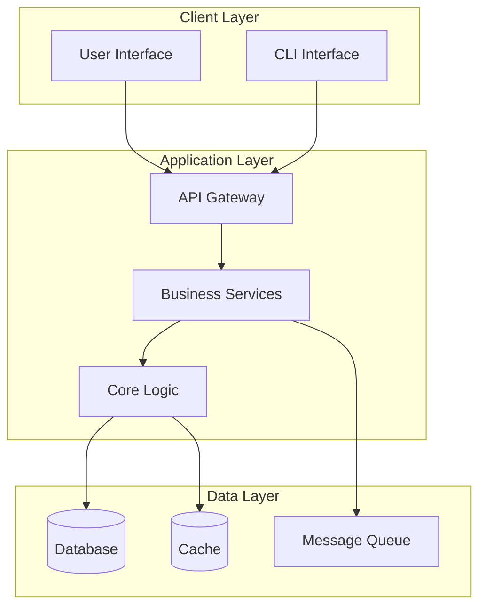

# Architecture Overview

<!-- TEMPLATE GUIDE (이 주석은 실제 프로젝트에서 삭제하세요 / Delete this comment in actual projects)

이 파일은 시스템의 전체 아키텍처를 문서화합니다.
This file documents the overall system architecture.

작성 시 포함해야 할 내용 / What to include:
- High-level system diagram (Mermaid or ASCII art)
- Key architectural components and their roles
- Design principles guiding the architecture
- Technology choices and rationale
- Integration points and boundaries

이 문서를 작성하는 이유 / Why this document matters:
- 새로운 개발자가 시스템 구조를 빠르게 이해할 수 있습니다
- 아키텍처 결정의 근거를 명확히 합니다
- 시스템 변경 시 영향 범위를 파악하는 기준점이 됩니다

-->

> High-level system architecture for {{project-name}}.
>
> **Navigation**: [docs/](../index.md) > architecture > overview

---

## System Overview

<!-- 시스템의 전체 구조를 한눈에 보여주는 다이어그램을 작성하세요
     Write a diagram showing the overall system structure -->

### Architecture Diagram



<!-- Alternative: ASCII art for simpler architectures
     간단한 아키텍처의 경우 ASCII 아트를 사용할 수 있습니다 -->

```
┌──────────────────────────────────────────────────────────┐
│                     Client Layer                         │
│  ┌──────────────┐              ┌──────────────┐         │
│  │  Web Client  │              │  CLI Client  │         │
│  └──────┬───────┘              └──────┬───────┘         │
│         │                              │                 │
└─────────┼──────────────────────────────┼─────────────────┘
          │                              │
          └──────────────┬───────────────┘
                         │
┌────────────────────────▼─────────────────────────────────┐
│                  Application Layer                       │
│  ┌──────────────────────────────────────────────────┐   │
│  │              API Gateway / Router                 │   │
│  └──────────────────────┬───────────────────────────┘   │
│                         │                                │
│  ┌──────────────────────▼───────────────────────────┐   │
│  │            Business Logic / Services              │   │
│  └──────────────────────┬───────────────────────────┘   │
└─────────────────────────┼────────────────────────────────┘
                          │
┌─────────────────────────▼────────────────────────────────┐
│                     Data Layer                           │
│  ┌─────────────┐  ┌─────────────┐  ┌─────────────┐     │
│  │  Database   │  │    Cache    │  │  File Store │     │
│  └─────────────┘  └─────────────┘  └─────────────┘     │
└──────────────────────────────────────────────────────────┘
```

### Architecture Style

<!-- 사용된 아키텍처 스타일을 명시하세요 / Specify the architectural style used -->

**Pattern**: _[e.g., Layered Architecture, Hexagonal Architecture, Microservices, Event-Driven]_

**Key Characteristics**:
- _[Characteristic 1, e.g., "Clear separation of concerns between layers"]_
- _[Characteristic 2, e.g., "Dependency injection for loose coupling"]_
- _[Characteristic 3, e.g., "Event-driven communication between services"]_

**Example** (for a typical Node.js web application):
- **Pattern**: Layered Architecture with Clean Architecture principles
- **Key Characteristics**:
  - Controller layer handles HTTP requests/responses
  - Service layer contains business logic
  - Repository layer abstracts data access
  - Domain models are independent of frameworks

---

## Key Components

<!-- 시스템의 주요 구성 요소를 나열하세요
     List the major building blocks of your system -->

| Component | Responsibility | Layer |
|-----------|----------------|-------|
| _[e.g., API Gateway]_ | _[e.g., Route requests, authentication, rate limiting]_ | _[Application]_ |
| _[e.g., User Service]_ | _[e.g., User management and authentication logic]_ | _[Application]_ |
| _[e.g., Database]_ | _[e.g., Persistent data storage]_ | _[Data]_ |
| _[e.g., Cache]_ | _[e.g., High-speed data caching for performance]_ | _[Data]_ |

**Example** (for a document processing system):

| Component | Responsibility | Layer |
|-----------|----------------|-------|
| Document API | REST endpoints for document operations | Application |
| Parser Service | Extract and structure document content | Application |
| Storage Service | Manage document persistence and retrieval | Application |
| PostgreSQL | Store structured document metadata | Data |
| S3 / File Store | Store raw document files | Data |
| Redis | Cache parsed document results | Data |

For detailed component documentation, see [components.md](./components.md).

---

## Design Principles

<!-- 아키텍처 설계 시 따른 원칙들을 기술하세요
     Document the principles that guide your architectural decisions -->

### Core Principles

1. **_[Principle 1, e.g., Single Responsibility]_**: _[Description, e.g., "Each module has one clearly defined purpose"]_
2. **_[Principle 2, e.g., Dependency Inversion]_**: _[Description, e.g., "High-level modules don't depend on low-level modules"]_
3. **_[Principle 3, e.g., Fail Fast]_**: _[Description, e.g., "Validate inputs early and provide clear error messages"]_

**Example Principles**:

1. **Separation of Concerns**: Each layer has a clear, distinct responsibility
   - Controllers: Handle HTTP and validation
   - Services: Implement business logic
   - Repositories: Manage data access

2. **Dependency Inversion**: Business logic doesn't depend on infrastructure
   - Services depend on repository interfaces, not implementations
   - Easy to swap database or external APIs
   - Testable without real infrastructure

3. **Fail Fast & Loud**: Errors are caught early and reported clearly
   - Input validation at API boundary
   - Type safety throughout the codebase
   - Detailed error messages for debugging

4. **Scalability by Design**: Built to handle growth
   - Stateless services for horizontal scaling
   - Caching strategy for read-heavy operations
   - Async processing for long-running tasks

---

## Technology Choices

<!-- 기술 스택과 선택 이유를 명확히 기록하세요
     Document your tech stack and rationale clearly -->

| Area | Technology | Rationale |
|------|------------|-----------|
| Language | _[e.g., TypeScript]_ | _[e.g., "Type safety, better IDE support, catches errors at compile time"]_ |
| Runtime | _[e.g., Node.js]_ | _[e.g., "Async I/O, large ecosystem, team expertise"]_ |
| Database | _[e.g., PostgreSQL]_ | _[e.g., "ACID compliance, JSON support, mature ecosystem"]_ |
| Cache | _[e.g., Redis]_ | _[e.g., "High performance, simple API, persistence options"]_ |
| _[Other]_ | _[Tech]_ | _[Why]_ |

**Example Technology Choices**:

| Area | Technology | Rationale |
|------|------------|-----------|
| Language | TypeScript 5.x | Type safety prevents runtime errors, excellent IDE support, enforces contracts between modules |
| Runtime | Node.js 20 LTS | Non-blocking I/O ideal for API servers, vast npm ecosystem, team has deep expertise |
| Web Framework | Express.js | Minimal and flexible, well-documented, large middleware ecosystem |
| Database | PostgreSQL 16 | ACID guarantees for data integrity, powerful JSON support, proven at scale |
| ORM | Prisma | Type-safe database client, excellent migrations, auto-generated types |
| Cache | Redis 7.x | Sub-millisecond latency, simple key-value API, supports complex data structures |
| Testing | Vitest | Fast, modern, excellent TypeScript support, compatible with Jest |
| API Docs | OpenAPI 3.1 | Industry standard, generates client SDKs, interactive documentation |

### Technology Decision Records

For detailed rationale behind major technology choices, see:
- [ADR-001: Database Selection](../../meta/decisions/001-database-selection.md) _(example)_
- [ADR-002: API Framework Choice](../../meta/decisions/002-api-framework.md) _(example)_

---

## Integration Points

<!-- 외부 시스템과의 연동 지점을 명시하세요
     Document integration points with external systems -->

### External Systems

| System | Integration Method | Purpose |
|--------|-------------------|---------|
| _[e.g., Payment Gateway]_ | _[e.g., REST API]_ | _[e.g., Process payments]_ |
| _[e.g., Email Service]_ | _[e.g., SMTP]_ | _[e.g., Send transactional emails]_ |

**Example**:

| System | Integration Method | Purpose |
|--------|-------------------|---------|
| AWS S3 | SDK (aws-sdk-js) | Store uploaded documents |
| SendGrid | REST API | Send notification emails |
| Stripe | REST API + Webhooks | Process payments and subscriptions |
| Auth0 | OAuth 2.0 / OIDC | User authentication and SSO |

---

## Security Considerations

<!-- 보안 관련 아키텍처 결정사항을 기록하세요
     Document security-related architectural decisions -->

### Security Layers

1. **Authentication & Authorization**
   - _[e.g., "JWT tokens with 15-minute expiry"]_
   - _[e.g., "Role-based access control (RBAC)"]_

2. **Data Protection**
   - _[e.g., "Encryption at rest using AES-256"]_
   - _[e.g., "TLS 1.3 for data in transit"]_

3. **Input Validation**
   - _[e.g., "Schema validation at API boundary"]_
   - _[e.g., "Parameterized queries to prevent SQL injection"]_

---

## Performance Characteristics

<!-- 성능 관련 설계 결정을 문서화하세요
     Document performance-related design decisions -->

### Performance Goals

- **API Response Time**: _[e.g., "95th percentile < 200ms"]_
- **Throughput**: _[e.g., "1000 requests/second"]_
- **Concurrent Users**: _[e.g., "10,000 simultaneous connections"]_

### Performance Strategies

- **Caching**: _[e.g., "Redis for frequently accessed data, 5-minute TTL"]_
- **Database Indexing**: _[e.g., "Indexes on userId, createdAt for common queries"]_
- **Async Processing**: _[e.g., "Background jobs for long-running tasks"]_

---

## Scalability Approach

<!-- 확장성 전략을 명시하세요
     Document your scalability strategy -->

### Horizontal Scaling

- **Stateless Services**: All application servers are stateless
- **Load Balancing**: _[e.g., "AWS ALB with health checks"]_
- **Session Management**: _[e.g., "JWT tokens, no server-side sessions"]_

### Vertical Scaling

- **Database**: _[e.g., "Can scale PostgreSQL instance up to 64 vCPU"]_
- **Bottlenecks**: _[e.g., "Cache layer can handle 100K ops/sec"]_

---

## Related Documents

- [Component Details](./components.md) - Deep dive into each component
- [Data Flow](./data-flow.md) - How data moves through the system
- [Architecture Decisions](../../meta/decisions/) - ADRs explaining key choices
- [API Reference](../api/reference.md) - API contracts and interfaces
